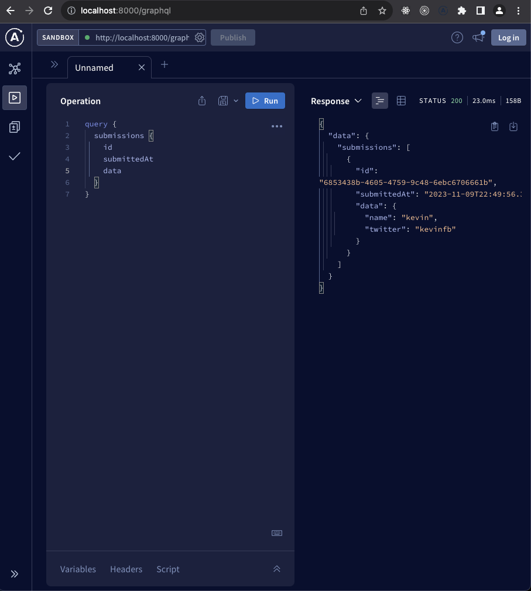

# form-hub

It is an implementation as monorepo of 2 differnet apps: [frontend](https://github.com/codeForMobile/formhub-fe) and [backend](https://github.com/codeForMobile/formhub-be) using turborepo. Respective readme's can be located in both the apps for better documentation of each repo, tech stack and implementation.

## What's inside?

This Turborepo includes the following packages/apps:

### Apps and Packages

- `backend`: graphql, typescript based backend consuming postgres db.
- `frontend`: react app based on CRA. Uses prisma for type generation and graphQL for connectivity.

### Boilerplate packages

comes with turborepo but not used extensively apart from their
pre-defined roles.

- `ui`: a stub React component library shared by both `web` and `docs` applications
- `eslint-config-custom`: `eslint` configurations (includes `eslint-config-next` and `eslint-config-prettier`)
- `tsconfig`: `tsconfig.json`s used throughout the monorepo

To build all apps and packages, run the following command:

```
cd my-turborepo
pnpm build
```

### Develop

To develop all apps and packages, run the following command:

```
cd my-turborepo
pnpm dev

```

Up all 3 containers `backend`, `redis` and `postgres` using
`docker-compose up`

### How backend looks


